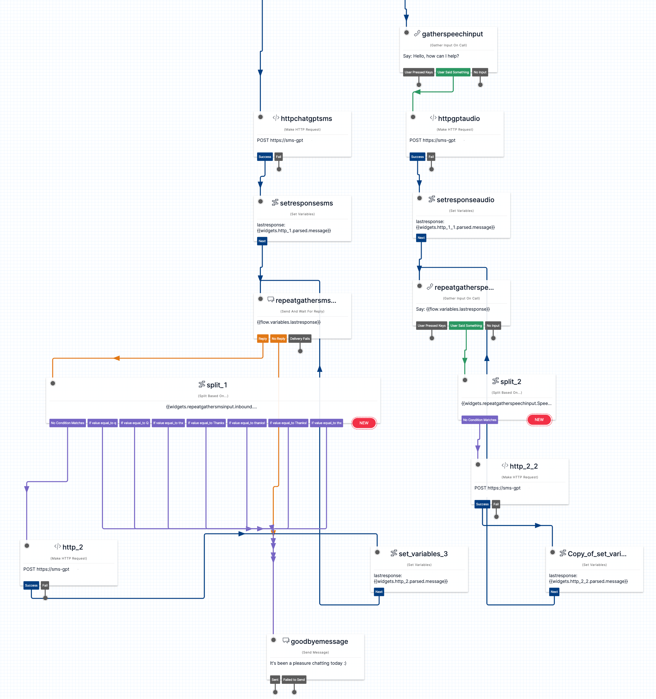

# ☎️ PhoneGPT

Interface for conversational ChatGPT via SMS or audio call

To set up, acquire an [OpenAI API key](https://platform.openai.com/account/api-keys) and set it in `env.sh` - you'll also want to set PHONE_GPT_KEY to an arbitrary key of your choosing for highly rudimentary authentication.

## Setup
To get started, create a virtual environment:
```bash
virtualenv venv
source venv/bin/activate.sh
```

Install requirements:
```bash
pip install -r requirements.txt
```

And start:
```bash
./start.sh
```

Set up a Twilio Flow in Flow Studio using the JSON in `flow.json`, replacing `PHONE_GPT_API_KEY` with the key you set in your `env.sh` above.  Assign it to a phone number (i.e. update triggers for incoming calls and texts to point to this flow) and you'll be set to start texting/calling PhoneGPT.

Replace "https://sms-gpt" with the URL to your webhook (i.e. a serverless function which runs `main_serverless.py` or a web server running `main.py`)

## Twilio Flow

